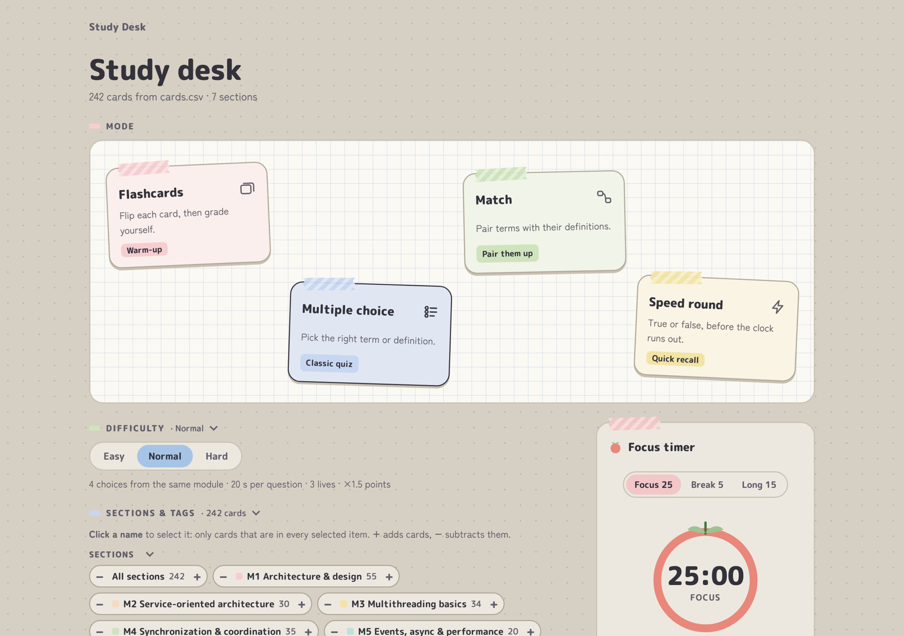

# Study Desk · Flashcard Study App

A free, offline flashcard study app built with plain HTML, CSS and JavaScript. You can run your own deck from a CSV file, quiz yourself four different ways, and track what you know. It has no install, no account and no dependencies.



## Features

- **Four study modes:** Flashcards, Multiple choice, Match, and Speed round (true/false against the clock).
- **Three difficulty levels** that change time limits, answer choices, lives and scoring.
- **CSV decks:** edit cards in any spreadsheet app. Each card has a section, tags, a term, a definition and an optional example.
- **Card picker:** select, add or subtract sections and tags, skip cards you already know, and preview the cards before you start.
- **Progress tracking:** got-it and study-again marks, starred cards and best scores. Progress saves to a local `progress.json` file or to the browser.
- **Pomodoro focus timer** that keeps running while you play.
- **Quizlet / Anki export:** copy the whole deck as tab-separated text.

It comes with a sample deck of 242 cards on distributed systems, multithreading, synchronization and web services (SOAP, REST, WCF).

## Getting started

| How | Progress is saved to |
|---|---|
| **macOS:** double-click `Open Flashcards.command` | `progress.json` in the folder |
| **Windows / Linux / macOS:** run `python3 server.py`, then open the printed address | `progress.json` in the folder |
| Open `index.html` directly | your browser |
| Host the folder on GitHub Pages or any static host | each visitor's browser |

`server.py` needs Python 3.7+ and only listens on `127.0.0.1`.

## Making your own deck

Replace the rows in `cards.csv`:

| Column | Notes |
|---|---|
| `section` | One per card, e.g. `M1 - Architecture & design`. |
| `tags` | Any number, separated by `;`, e.g. `code; java`. |
| `title` | The term. It also identifies the card in saved progress. |
| `info` | The definition. Wrap code in backticks. |
| `example` | Optional. |

`cards-builtin.js` is a copy of the CSV that lets the app work when you open it as a file. `server.py` regenerates it on every start.

## Choosing cards

Every section, tag and pile on the start screen has three actions:

- **Click the name to select it.** Selecting is a filter: only cards in *every* selected item stay.
- **`+` adds** that item's cards.
- **`−` subtracts** that item's cards.

The result is **(selected items, overlapped) + added − subtracted**. The line under the picker shows the current formula and card count.

## Customizing

- **Look:** `styles.css` starts with design tokens (colors, fonts, spacing). New UI is built from shared primitives: `.panel` `.sheet` `.stack` `.cluster` `.btn` `.chip` `.badge` `.choice` `.field` `.fold`. Accent colors are passed in through `--c`.
- **Countdown:** set `COUNTDOWN` at the top of `app.js`, e.g. `{ label: "Exam", date: "2025-12-15" }`.
- **New game mode:**
  1. Add an entry to `MODES` in `app.js`.
  2. Add an `IMPL` object whose `start()` renders into `stage`.
  3. Have it call `finish()` when the game ends.

## Project structure

```
index.html               page structure
styles.css               tokens → base → primitives → components
app.js                   card loading, saving, picker, game modes
cards.csv                the deck
cards-builtin.js         generated copy of cards.csv
server.py                optional local server that writes progress.json
Open Flashcards.command  macOS launcher for server.py
```
